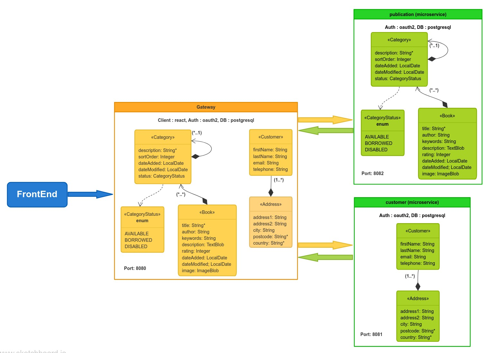

# gateway - microservice architecture

The application includes a gateway and two microservices (publication and user). The API implementation is as follows:



The "gateway" application intended to be part of a microservice architecture, and be able to connect at [http://localhost:8080](http://localhost:8080).
All the applications are configured for Service Discovery and Configuration with the JHipster-Registry. On launch, it will refuse to start if it is not able to connect to the JHipster-Registry at [http://localhost:8761](http://localhost:8761). All the applications use keycloak as a single sign-on with Identity and Access Management, it runs at [http://localhost:9080](http://localhost:9080).


## Using Docker to run all the services

You can fully dockerize your application and all the services that it depends on.
To achieve this, first build a docker image for all your app (i.e, gateway, publication, user - at each directory) by running:

```
./gradlew bootJar -Pprod jibDockerBuild
```

Then run:

```
docker-compose -f docker/app.yml up -d
```

To stop it and remove the container, run:

```
docker-compose -f docker/app.yml up down
```

Note: at [docker/.env](docker/.env) file update the HOST IpAddress to your IP address

